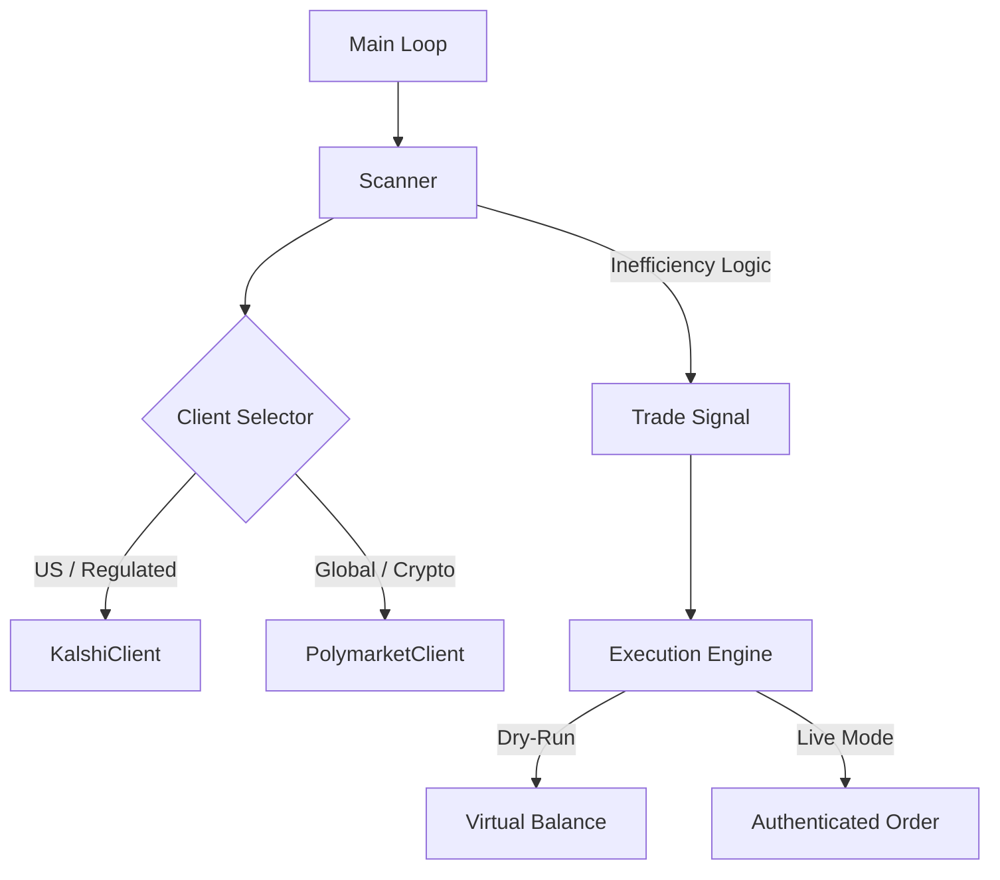

# 👻 GhostTrades: Multi-Market Arbitrage Bot

GhostTrades is an automated system designed to identify and exploit pricing inefficiencies on prediction markets (Polymarket and Kalshi), specifically focusing on "Unity" constraint violations in binary markets.

## 🚀 Overview

The bot scans order books to find situations where the combined price of YES and NO contracts for a specific event is less than $1.00 (or 100¢). By purchasing both outcomes, the bot captures a guaranteed, risk-free profit upon event resolution.

### Key Architecture



## 🛠️ Tech Stack

- **Python 3.12+**: Core logic.
- **Docker**: Containerized execution and dependency management.
- **Kalshi SDK**: `kalshi-python` (v2) for US-regulated trading.
- **Polymarket SDK**: `py-clob-client` for EIP-712 signing.
- **Cryptography**: RSA-PSS signing for Kalshi v2 authentication.
- **AsyncIO**: Concurrent market scanning and execution.

## ⚙️ Configuration

### 1. Obtain API Credentials
- **Kalshi (US)**: Go to [Kalshi Settings](https://kalshi.com/settings/api), generate an API Key, and save the `.pem` private key.
- **Polymarket (Global)**: Go to [Polymarket Settings](https://polymarket.com/settings) and generate an API Key.

### 2. Setup Environment
- Copy `.env.example` to `.env`:
```bash
cp .env.example .env
```
- Fill in your credentials for either (or both) platforms.

| Variable | Description | Default |
| :--- | :--- | :--- |
| `LIVE_MODE` | Set to `true` to enable real trades. | `false` |
| `TRADE_LIMIT_USD` | Maximum USD amount to invest per trade. | `10.0` |
| `MIN_PROFIT_USD` | Minimum profit per share required to signal a trade. | `0.01` |
| `SLIPPAGE_TOLERANCE`| Max price movement allowed for execution. | `0.01` |
| `MARKET_SCAN_LIMIT`| Number of markets to scan per loop. | `100` |
| `POLL_INTERVAL_SECONDS`| Seconds to wait between scans. | `3` |
| `KALSHI_ENVIRONMENT`| `demo` for testing, `prod` for real funds. | `demo` |

## 🏃 Getting Started

### Option A: Running with Docker (Recommended)
1. **Build**: `docker-compose build`
2. **Launch**: `docker-compose up -d`
3. **Monitor**: `docker-compose logs -f`

### Option B: Running Locally
1. **Install Dependencies**:
```bash
pip install -r requirements.txt
```
2. **Run**:
```bash
PYTHONPATH=. python3 src/main.py
```

## 📜 Documentation

- [Architecture Overview](file:///Users/ryanhutto/projects/Trader/docs/architecture.md)
- [API Reference](file:///Users/ryanhutto/projects/Trader/docs/API.md)
- [Architecture Decisions (ADRs)](file:///Users/ryanhutto/projects/Trader/docs/decisions/)

## ⚠️ Disclaimer

Trading involves significant risk. This bot is provided for educational purposes. Always start in "Dry-Run" mode (`LIVE_MODE=false`) or `Kalshi Demo` to verify strategies before committing real capital.
