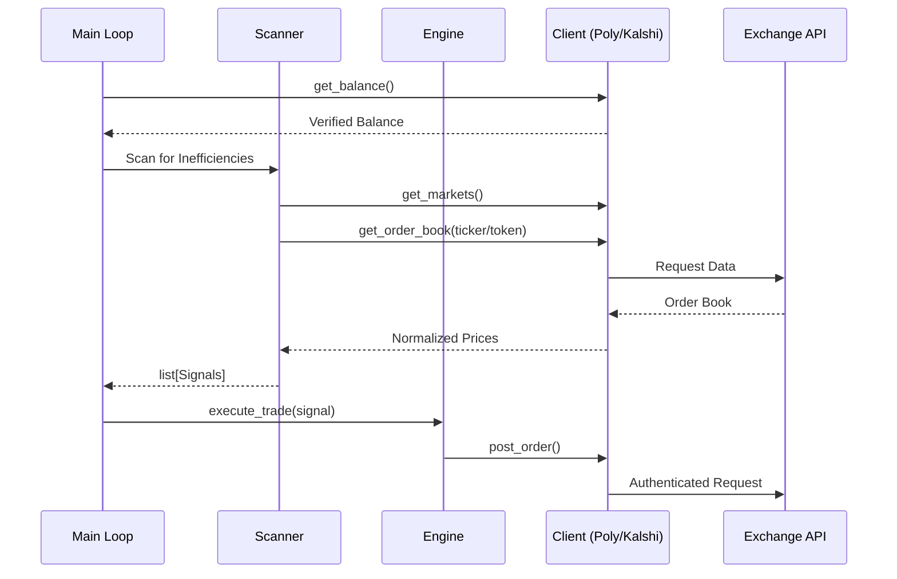

# Architecture: GhostTrades Bot

## System Overview
The GhostTrades bot is an automated, asynchronous system designed to identify and exploit pricing inefficiencies on prediction markets. It specifically targets **Unity Arbitrage** opportunities where the sum of outcomes is less than $1.00.

## Key Components

### 1. **Client Layer (src/client.py & src/kalshi_client.py)**
- **PolymarketClient**: Gateway to Polygon-based prediction markets using EIP-712 signing.
- **KalshiClient**: Gateway to US-regulated markets using RSA-PSS signatures (v2 API).
- **Dynamic Selection**: `main.py` detects credentials and initializes the appropriate client.

### 2. **Scanner (src/scanner.py)**
- **Role**: The "Eyes" of the bot.
- **Logic**: Continuously monitors the order books of the most active markets.
- **Inefficiency Detection**: If `Price(YES) + Price(NO) < 1.0`, a trade signal is generated.

### 3. **Engine (src/engine.py)**
- **Role**: Execution and Risk Management.
- **Live Execution**: Simultaneously places orders for both outcomes to capture the spread.
- **Dry-Run**: Updates a persistent balance without risking real capital.

## Logic Flow

## Security & Reliability
- **Credential Storage**: Uses `.env` and volume-mounted `.pem` files in Docker.
- **Containerization**: Runs in a minimal `python-slim` Docker environment to ensure stability.
- **Non-blocking I/O**: Built on `asyncio` for high-performance scanning.
